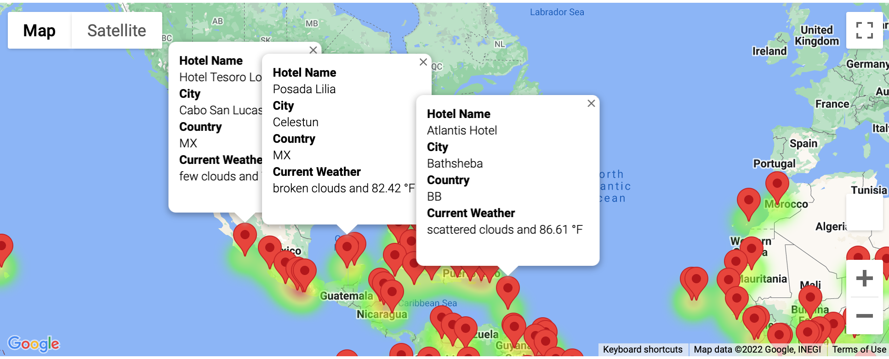
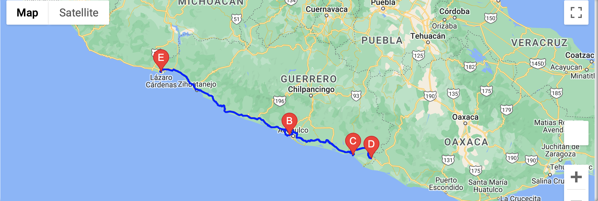
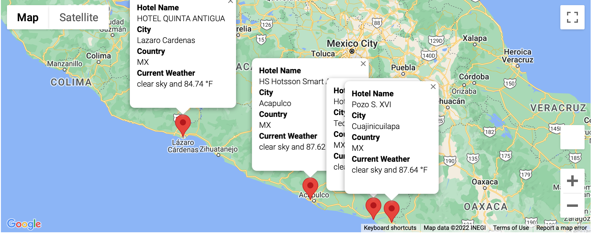

# World_Weather_Analysis
# **Purpose**
The purpose of this assignment was to help create an app called PlanMyTrip. The code should allow users to input their desired weather preferences and then identify potential travel destinations. From this information a potential itinerary can be made.

## **Goal**
- Retrieve Weather Data
- Create a Customer Travel Destinations Map
- Create a Travel Itinerary Map

## **Resources**
- Resources: WeatherPy_Database.csv, WeatherPy_vacation.csv
- Software: Python, Pandas, Jupyter notebook, Numpy, Citipy, Gmaps

## **Results**

**Retrieve Weather Data**
In order to do this, the following steps were taken:
- Generated a set of 2,000 random latitudes and longitudes.
- Retrieved the nearest city and performed an API call with OpenWeatherMap.
- Retrieved weather data and current weather description for each city.
- Created a new DataFrame containing the updated weather data.

**Create a Customer Travel Destinations Map**
In order to do this, the following steps were taken:
- Used input statements to retrieve customer weather preferences. For this example, I chose a minimum temperature of 75 and a max of 100.
- Used the preferences to identify potential travel destinations and nearby hotels. 
- Displayed the destinations on a marker layer map with pop-up markers

**Create a Travel Itinerary Map**
- Used the Google Directions API to create a travel itinerary that shows the route between four chosen cities. For the example I chose: Lazaro Cardenas, Acapulco, Tecoanapa, and Cuajinicuilapa all in Mexico

- Created a marker layer map with a pop-up marker for each city on the itinerary

